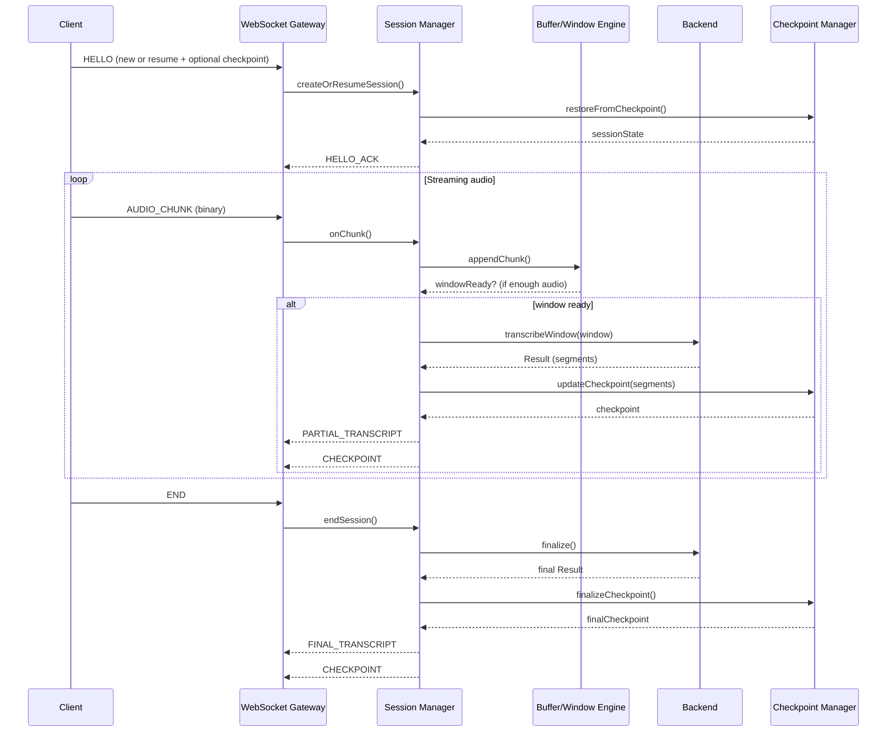
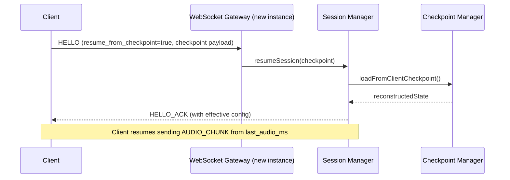
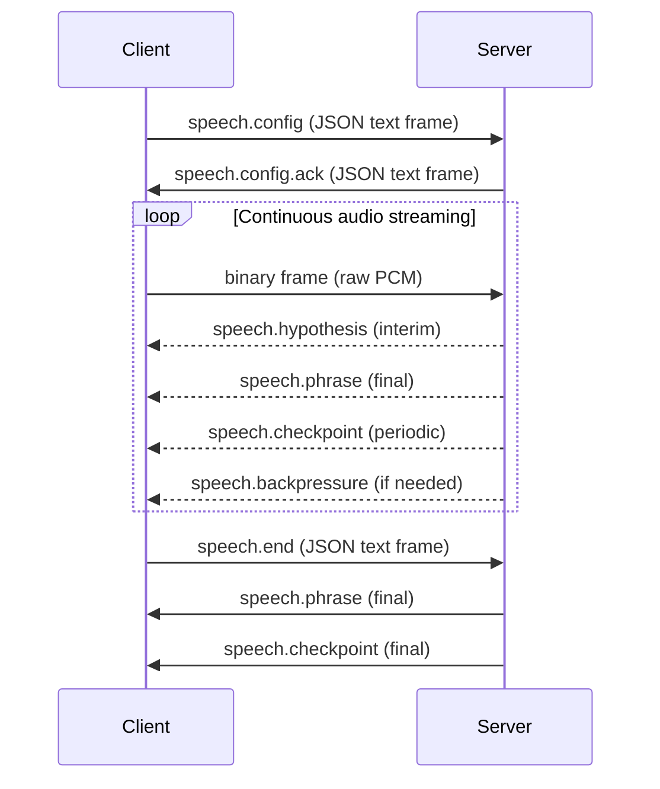

### `ARCHITECTURE.md`

# WhisperX Streaming Transcription Server – Architecture

## 1. Overview

**Goal:**  
A lean, low‑overhead C++20 WebSocket server that ingests real‑time audio, buffers it into configurable windows, calls a WhisperX‑based backend, and streams transcripts back.  

**Design priorities:**

- Non‑blocking, event‑driven I/O (no per‑connection blocking threads)
- Memory‑efficient chunk handling (zero‑copy where possible)
- Checkpoints include **transcription state** so another instance can resume
- No mandatory local persistence (stateless from the node’s perspective)
- Pluggable model backends via minimal C++ interfaces
- Docker‑friendly for building images with different models

---

## 2. High-level architecture

### 2.1 Components

- **WebSocket Gateway**
  - Based on an async networking library (e.g., Boost.Asio + Beast or uWebSockets)
  - Handles:
    - Connection lifecycle
    - JSON control messages
    - Binary audio frames
  - Uses a small, fixed thread pool (e.g., N I/O threads)

- **Session Manager**
  - Maintains per‑session state in memory:
    - Audio buffer metadata
    - Buffering configuration
    - Transcription progress
    - Checkpoint data (including transcript)
  - Uses lock‑free or fine‑grained structures to avoid contention
  - Stateless across nodes: session state can be serialized and sent elsewhere if needed

- **Buffering & Windowing Engine**
  - Aggregates small audio chunks into windows:
    - `window_duration_ms` (configurable)
    - `overlap_duration_ms` (configurable)
  - Emits windows to the backend via a work queue
  - Uses contiguous buffers (e.g., `std::vector<int16_t>`) to minimize allocations

- **Transcription Backend Interface**
  - Abstracts the model runtime:
    - WhisperX, Faster‑Whisper, or others
  - Implementations may:
    - Call an external microservice (HTTP/gRPC)
    - Or embed Python via PyBind11 (optional, but heavier)

- **Result Aggregator**
  - Merges overlapping window results
  - Deduplicates segments
  - Maintains a **growing transcript** per session
  - Produces:
    - Partial segments
    - Final transcript

- **Checkpoint Manager**
  - Produces **in‑memory checkpoint objects**:
    - Audio position
    - Full transcript so far
    - Buffer configuration
    - Backend model ID
  - Checkpoints are:
    - Sent to the client (so the client can store them)
    - Optionally forwarded to an external store (Redis, etc.) by another service
  - No disk I/O required in this server

---

## 3. Concurrency model

- **I/O layer:**
  - Event‑driven, async WebSocket
  - A small number of threads (e.g., equal to hardware concurrency)
  - Each thread runs an event loop (Asio or equivalent)

- **Per‑session processing:**
  - Audio chunks appended to per‑session buffers using lock‑free queues or per‑session mutexes
  - Window creation and backend calls dispatched to a worker pool:
    - Worker threads handle CPU‑side preprocessing and backend RPC
  - No blocking operations on I/O threads

- **Backpressure:**
  - Per‑session queue size limits
  - If a session exceeds limits, server can:
    - Drop oldest chunks
    - Or signal overload to client

---

## 4. Buffering, windowing, and checkpoints

### 4.1 Buffering & windowing

- **Configurable parameters:**
  - `window_duration_ms` (e.g., 5000–30000)
  - `overlap_duration_ms` (e.g., 500–5000)
- **Algorithm:**
  - Maintain a timeline of audio samples per session
  - When enough samples accumulate:
    - Build a window `[window_start_ms, window_end_ms]`
    - Schedule it for transcription
    - Advance `window_start_ms` by `window_duration_ms - overlap_duration_ms`

### 4.2 Checkpoints

- **Checkpoint contents:**

```cpp
struct Checkpoint {
    std::string sessionId;
    int64_t lastAudioMs;
    int64_t lastTextOffset;
    std::string fullTranscript;   // concatenated or structured
    BufferConfig bufferConfig;
    std::string backendModelId;
};
```

- **Behavior:**
  - After each processed window:
    - Update `fullTranscript` with new segments
    - Update `lastAudioMs` and `lastTextOffset`
    - Emit a `CHECKPOINT` message to the client
  - On resume:
    - Client sends `HELLO` with `resume_from_checkpoint` and a checkpoint payload
    - Server reconstructs session state from that checkpoint (no local storage needed)

---

## 5. Model backend abstraction

### 5.1 Interface

```cpp
class ITranscriptionBackend {
public:
    virtual ~ITranscriptionBackend() = default;

    struct Config {
        std::string language;
        int sampleRate;
        std::string modelId;
    };

    struct Segment {
        int64_t startMs;
        int64_t endMs;
        std::string text;
        std::string speaker; // optional
    };

    struct Result {
        std::vector<Segment> segments;
        bool isFinal;
    };

    virtual void initialize(const Config& config) = 0;

    virtual Result transcribeWindow(
        const int16_t* samples,
        size_t sampleCount,
        int64_t windowStartMs
    ) = 0;
};
```

- **Design goals:**
  - Pointer + length instead of `std::vector` to allow zero‑copy and custom allocators
  - Backend implementations can be swapped at link time or via factory + env vars

### 5.2 Backend implementations

- `WhisperXBackend`
  - Calls an external Python/WhisperX service (HTTP/gRPC)
  - Keeps C++ server lean and close to machine code
- `FasterWhisperBackend`
  - Calls a C++/CTranslate2 service or library
- `MockBackend`
  - For tests and benchmarks

---

## 6. Scaling & resource requirements

### 6.1 Target

- At least **20 concurrent sessions**
- Each session: up to 2‑hour audio

### 6.2 Resource assumptions (per node)

- **CPU:**
  - 8–16 cores
  - I/O threads: 2–4
  - Worker threads: remaining cores
- **RAM:**
  - Audio buffers:
    - 16 kHz, 16‑bit mono ≈ 32 KB per second
    - For 30 s window + overlap, per session buffer ≈ ~1–2 MB
    - 20 sessions → ~20–40 MB for raw audio
  - Transcripts + metadata: small compared to audio
  - Recommended: **16 GB RAM** to accommodate backend + overhead
- **GPU:**
  - Offloaded to backend service (not in this process) to keep this server lean

---

## 7. Dependencies & build

### 7.1 Core dependencies

- **C++ standard:** C++20
- **Networking / WebSocket:**
  - Option A: Boost.Asio + Boost.Beast
  - Option B: uWebSockets (very lean, high‑performance)
- **JSON:**
  - `nlohmann/json` (header‑only)
- **Logging:**
  - `spdlog` (header‑only)
- **Config:**
  - `toml++` or `yaml-cpp` (optional)

### 7.2 Build system

- **CMake** (3.20+)
- Targets:
  - `transcription_server` (main binary)
  - `backend_mock` (test)
  - `backend_whisperx_client` (optional)

### 7.3 Project layout

```text
/whisperx-streaming-server
  /src
    main.cpp
    websocket_server.cpp
    session_manager.cpp
    buffer_engine.cpp
    result_aggregator.cpp
    checkpoint_manager.cpp
    backend_interface.hpp
    backend_whisperx_client.cpp
    backend_mock.cpp
  /include
    config.hpp
    protocol.hpp
  /docker
    Dockerfile.base
    Dockerfile.whisperx-client
  /config
    server.toml
  /docs
    ARCHITECTURE.md
    PROTOCOL.md
```

---

## 8. Sequence diagrams

### 8.1 Session start & streaming



### 8.2 Resume on a different instance



---

---

### `PROTOCOL.md`

# WhisperX Streaming Transcription Server – Azure-Aligned WebSocket Protocol

## 1. Transport

- **Protocol:** WebSocket over TCP
- **Encoding:**
  - Control messages: JSON text frames (UTF‑8)
  - Audio: binary frames (raw PCM — no per-chunk JSON metadata)
- **Connection:**
  - URL: `wss://host/transcribe`

---

## 2. Common envelope

All JSON messages share this structure:

```json
{
  "type": "speech.<event>",
  "payload": { }
}
```

- `type`: dot-namespaced event type (see below)
- `payload`: event‑specific content

---

## 3. Session flow



---

## 4. Message types

### 4.1 `speech.config` (client → server)

Initialize a session. Sent once after connecting.

```json
{
  "type": "speech.config",
  "payload": {
    "language": "en",
    "sample_rate": 16000,
    "encoding": "pcm_s16le",
    "window_duration_ms": 5000,
    "overlap_duration_ms": 500,
    "model_id": "whisper-large-v3",
    "resume_checkpoint": null
  }
}
```

To resume from a previous checkpoint, pass the checkpoint object received from the server:

```json
{
  "type": "speech.config",
  "payload": {
    "language": "en",
    "sample_rate": 16000,
    "encoding": "pcm_s16le",
    "window_duration_ms": 5000,
    "overlap_duration_ms": 500,
    "model_id": "whisper-large-v3",
    "resume_checkpoint": {
      "session_id": "abc123",
      "last_audio_ms": 620000,
      "last_text_offset": 45678,
      "transcript": "Hello everyone ..."
    }
  }
}
```

---

### 4.2 `speech.config.ack` (server → client)

Confirms session is ready. The client must wait for this before sending audio.

```json
{
  "type": "speech.config.ack",
  "payload": {
    "session_id": "abc123",
    "effective_config": {
      "sample_rate": 16000,
      "encoding": "pcm_s16le",
      "window_duration_ms": 5000,
      "overlap_duration_ms": 500,
      "model_id": "whisper-large-v3"
    }
  }
}
```

---

### 4.3 Binary frames (client → server)

After receiving `speech.config.ack`, the client streams audio as **continuous binary WebSocket frames** containing raw PCM data.

- Format: 16‑bit little‑endian, mono, at the configured `sample_rate`
- No per-chunk JSON metadata — the server tracks timing from the byte stream
- Recommended chunk size: 200ms of audio (e.g., 6400 bytes at 16kHz)

---

### 4.4 `speech.hypothesis` (server → client)

Interim (partial) transcription result. May be revised as more audio arrives.

```json
{
  "type": "speech.hypothesis",
  "payload": {
    "offset_ms": 1200,
    "duration_ms": 3400,
    "text": "Hello everyone, thanks for"
  }
}
```

---

### 4.5 `speech.phrase` (server → client)

Final transcription result for a segment. Will not change.

```json
{
  "type": "speech.phrase",
  "payload": {
    "offset_ms": 1200,
    "duration_ms": 7700,
    "text": "Hello everyone, thanks for joining today.",
    "confidence": 0.94
  }
}
```

---

### 4.6 `speech.checkpoint` (server → client)

Periodic session state snapshot. Store this to resume the session later.

```json
{
  "type": "speech.checkpoint",
  "payload": {
    "session_id": "abc123",
    "last_audio_ms": 620000,
    "last_text_offset": 45678,
    "transcript": "Hello everyone ..."
  }
}
```

---

### 4.7 `speech.backpressure` (server → client)

Flow control signal. The client should slow down or pause sending audio.

```json
{
  "type": "speech.backpressure",
  "payload": {
    "buffered_ms": 15000,
    "max_buffered_ms": 20000,
    "action": "pause"
  }
}
```

- `action`: `"pause"` (stop sending) or `"resume"` (continue sending)

---

### 4.8 `speech.end` (client → server)

Signals that no more audio will be sent.

```json
{
  "type": "speech.end",
  "payload": {}
}
```

---

### 4.9 `speech.error` (server → client)

```json
{
  "type": "speech.error",
  "payload": {
    "code": "BUFFER_OVERFLOW",
    "message": "Session exceeded maximum buffered duration"
  }
}
```

---

## 5. Configuration knobs (for tuning)

- `sample_rate` — audio sample rate in Hz
- `encoding` — audio encoding (e.g., `pcm_s16le`)
- `window_duration_ms` — transcription window size
- `overlap_duration_ms` — overlap between windows
- `model_id` — backend model identifier

These can be:

- Provided in `speech.config`
- Overridden by server policy
- Exposed via config file (`server.toml`)

---
